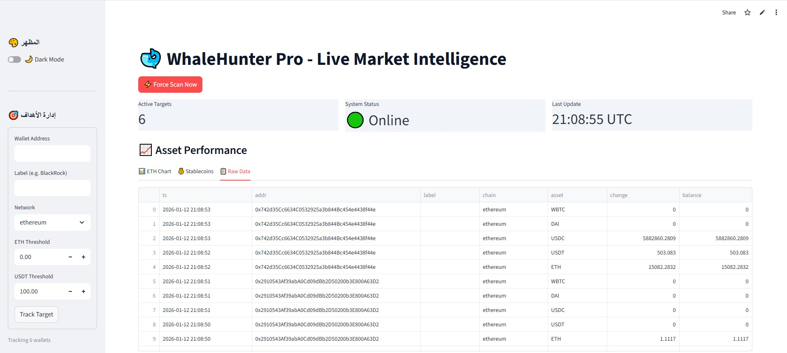
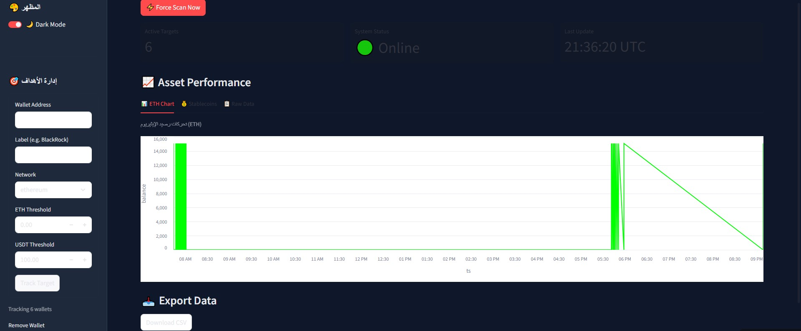

# 🐋 WhaleHunter Pro | Enterprise Blockchain Intelligence


> **⚠️ PORTFOLIO SHOWCASE:**
> This repository serves as a **technical demonstration and portfolio entry**. The core source code (`core/`, `modules/`) is **private/proprietary**.
> If you are interested in licensing this software, hiring for a similar project, or viewing a live demo, please [Contact Me](#-hire-me--contact).

---

## 📖 Overview
**WhaleHunter Pro** is a high-frequency, real-time monitoring system designed to track "Whale" wallets across **Ethereum, BSC, and Polygon**. It combines an asyncio-driven backend with a responsive Streamlit dashboard to visualize market movements instantly.

Includes **DragonHunter X**: A dedicated HFT-grade engine for **Solana** pool sniping and execution.

---

## 🎥 Live Demo & Visuals

### 🟢 1. The Dashboard (Real-time Monitoring)
*Interactive UI built with Streamlit allowing users to filter transactions by chain, amount, and token.*



### 📊 2. Analytics & Wealth Tracking
*Visualizing stablecoin flows (USDT/USDC) and ETH accumulation over time.*


### 🚨 3. Instant Telegram Alerts
*The bot pushes formatted alerts to private channels with Etherscan links within milliseconds of the transaction.*



### 🎬 Video Preview
Download or view the `WhaleHunter.mp4` file in this repository to see the system running in real-time.

---

## 🏗️ System Architecture (Under the Hood)

Since the code is private, here is an overview of the engineering architecture used to build this system:

```mermaid
graph TD
    A[Blockchain Nodes (RPC)] -->|Async Web3| B(Core Engine)
    B -->|Filter & Decode| C{Event Processor}
    C -->|High Value?| D[Notification Service]
    C -->|Data| E[(SQLite / PostgreSQL)]
    E --> F[Streamlit Dashboard]
    D --> G[Telegram/Discord]
File Structure Overview
The project follows a modular, scalable pattern:
```
```Plaintext
WhaleHunter-Pro/
├── core/
│   ├── engine.py          # Circuit breaker & Graceful shutdowns
│   ├── rpc_client.py      # Async RPC manager with exponential backoff
│   └── event_loop.py      # Main asyncio loop handler
├── modules/
│   ├── sniper.py          # DragonHunter X (Solana Sniping Logic)
│   ├── decoder.py         # ABI decoding for ERC-20/BEP-20
│   └── execution.py       # Jito bundle abstraction (MEV protection)
├── ui/
│   └── streamlit_app.py   # The frontend code shown in screenshots
└── config/
    └── settings.py        # Pydantic validation for ENV variables
```
✨ Key Features
🌐 Multi-Chain Surveillance
Chains: Ethereum, Binance Smart Chain (BSC), Polygon, Solana.

Logic: Listens to pending transactions (Mempool) and finalized blocks.

⚡ DragonHunter X (Solana Engine)
Stack: Built for speed using Asyncio and pure RPC calls.

Resilience: Auto-retry logic for RPC limits.

Execution: Integration with Jito Bundles for failed transaction protection.

🛡️ Robust Engineering
Error Handling: Implementation of Circuit Breakers to prevent cascading failures.

Security: Environment variables managed via Streamlit Secrets (no hardcoded keys).

Logging: Structured logging for debugging and performance metrics.

🛠️ Tech Stack
Language: Python 3.10+

Blockchain Libs: Web3.py, Solana.py, Jito-Labs SDK

Concurrency: asyncio, aiohttp

Data & UI: Streamlit, Pandas, SQLite

DevOps: Docker support (ready), Pydantic (config).

🤝 Hire Me / Contact
I am a Python Automation Engineer & Blockchain Developer available for freelance work and long-term contracts.

Need a custom bot?

Looking for a Scraper or Automation tool?

Need Smart Contract integration?
